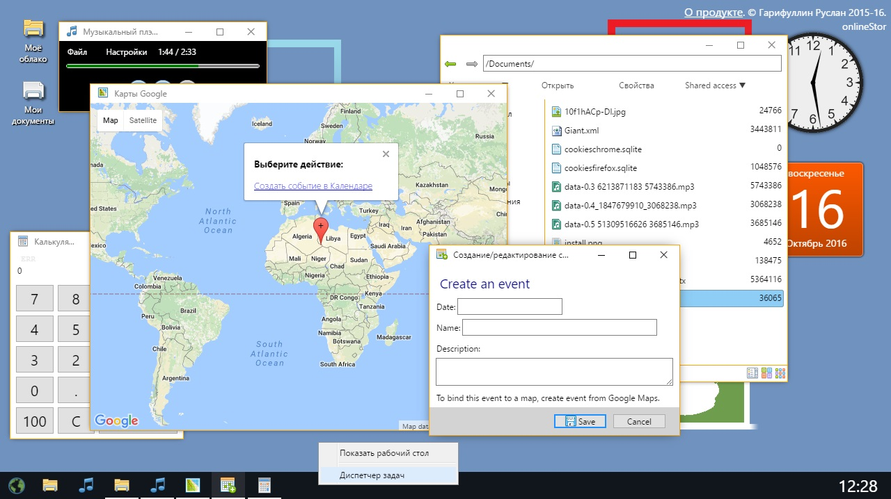

# Onlinestor, a web desktop

Unmaintained, was a project I did when I was in middle school in 2015-2017. Contains only the front-end part, 50% russian-50% english. Uploaded for the sake of history.

